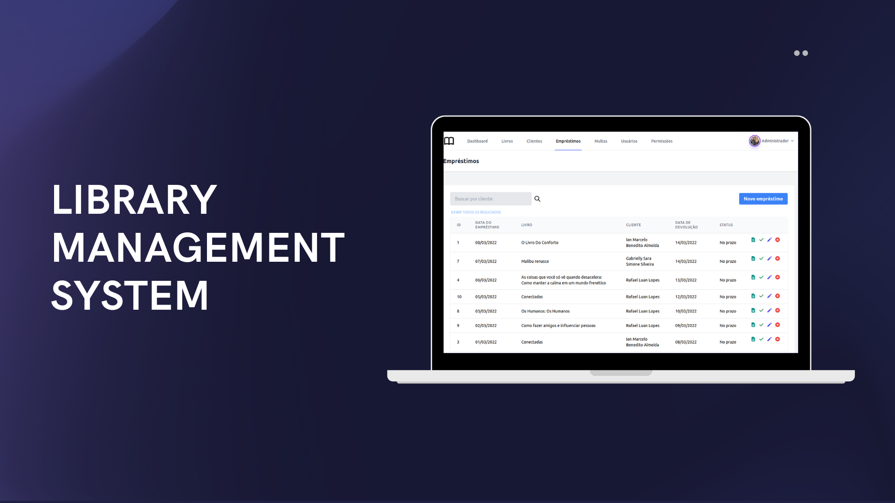

<div 
align="center"
style="display: flex; 
flex-direction: row;
gap: 10px">


</div>

<br>
<div align="center" style="display: flex; flex-direction: row">
   
    
    
</div>
<br>

<h1> Library management system 📚</h1>
<b> Index </b>
<div>
<ul>
<li><a href="#-about-the-project">About the project</a></li>
<li><a href="#-functionalities">Functionalities</a></li>
<li><a href="#-features">Features</a></li>
<li><a href="#-technologies">Technologies</a></li>
<li><a href="#-how-to-run-the-application">How to run the application</a></li>
<li><a href="#-how-to-contribute">How to contribute</a></li>
<li><a href="#-author">Author</a></li>
<li><a href="#-license">License</a></li>
</ul>
<div>
<div>
<h2>📄 About the project</h2>
<b>Status: Under construction 🚧
</b><br><br>
<p> The developed application consists of a management system for libraries, allowing the user to perform the main activities necessary in a library, such as registering books and customers and making loans.</p>
</div>
<div>
<h2>🔧 Functionalities</h2>
<ul>
<b>Users</b>
<li>✅ Register users</li>
<li>✅ View users</li>
<li>✅ Edit users</li>
<li>✅ Remove users</li>
<li>✅ Manage user permissions</li>
</ul>
<ul>
<b>Clients</b>
<li>✅ Register clients</li>
<li>✅ View clients</li>
<li>✅ Edit clients</li>
<li>✅ Remove clients</li>
</ul>
<ul>
<b>Books</b>
<li>✅ Register books</li>
<li>✅ View books</li>
<li>✅ Edit books</li>
<li>✅ Remove books</li>
</ul>
<ul>
<b>Loans</b>
<li>✅ Carry out loan of books to customers, respecting the loan conditions</li>
<li>✅ List loans by searching by customer name</li>
<li>✅ Editing a Loan, before returning</li>
<li>✅ Renew loans</li>
<li>✅ Delete loan, before return</li>
<li>✅ Check out returned books</li>
<li>✅ Calculate fines if a book is not returned on time</li>
<li>✅ Pay off customer debts with the library</li>
</ul><br>
</div>
<div>
<h2>🔨 Features</h2>
<ul>
<li>Improve system dashboard</li>
<li>Improve system interface</li>
<li>Improve confirmation popup on delete</li>
<li>Set the app to dark mode</li>
<li>Allow sorting of columns in table</li>
<li>Sending an email when making the loan and making its return</li>
<li>Allow adding photos of books and customers</li>
<li>Display photos of books, customers and users in the table</li>
<li>Allow partial payment of fine</li>
<li>Validate fields when editing information</li>
<li>Display name of books and customers in the loan select, instead of ID</li>
<li>Use the <code>'DD/MM/YYYY'</code> date format in the dayPicker.</li>
<li>Automatically calculate book return date</li>
<li>Create a specific area or modal for book renewal</li>
</ul>
<br>
</div>
<div>
<h2>🧑‍💻 Technologies</h2>
<a href="https://www.php.net/manual/en/">

</a>
<a href="https://laravel.com/docs/8.x">

</a>
<a href="https://tailwindcss.com/docs/installation">

</a>
<a href="https://dev.mysql.com/doc/">

</a>
<br></br>
</div>
<div>
<h2>🚀 How to run the application</h2>
<b>Prerequisites</b>
<p>Before starting, you must have the following tools installed on your machine: <a href="https://git-scm.com/">Git</a>, <a href="https://www.php.net/downloads.php">PHP</a> (preferably version 7.4), <a href="https://getcomposer.org/download/">Composer</a>, <a href="https://www.mysql.com/downloads/">MySQL</a>and also an editor, to work with the code, like <a href="https://code.visualstudio.com/">VSCode</a>.
<br><br>
<b>Project download</b>
<br>
1. Clone this repository by running: <br>
<code>git clone https://github.com/andersondev96/library-project</code>
<br>
2. Access the folder <code>/library-project</code>.
<br>
3.Open VSCode, running: <code>code .</code><br>
4. Install the project's dependencies, with the command: <code>composer install</code><br><br>
<b>Database configuration</b><br>
1.In the <code>.env</code> file, configure the database credentials, use <code>.env.example</code> if necessary.

```
DB_CONNECTION=mysql
DB_HOST=127.0.0.1
DB_PORT=3306
DB_DATABASE=library
DB_USERNAME=<username>
DB_PASSWORD=<password>
```
2. Now you must run this <a href="script.sql">mysql script</a>, for your database to appear, populated.
3. After running the script, run the application with the command **php artisan serve**.
4. Run the application on the **http://localhost:8000** port.

<br>
<h2>🤝 How to contribute</h2>
<ol>
    <li>Fork the repository.</li>
    <li>Create a new branch with your changes: <code> git checkout -b my-feature </code> .</li>
    <li>Save your changes and create a commit message, saying what you did: <code> git commit -m "feature: My new feature"</code>.</li>
    <li>Submit your changes:<code>git push origin my-feature</code>.</li>
</ol>
<br>
<h2>👥 Author</h2>
<a href="https://www.linkedin.com/in/anderson-fernandes96/">
    <div style="display: flex; flex-direction: column; align-items: center; gap: 10px">
    
    <strong>Anderson Fernandes Ferreira</strong>
    </div><br>
    <div style="display:flex; flex-direction:row;gap:8px;">
        <a href="https://instagram.com/anderson_ff13" target="_blank"></a>
  <a href = "mailto:andersonfferreira96@gmail.com.br"></a>
  <a href="https://twitter.com/anderson_4nd" target="_blank"></a> 
    <a href="https://www.linkedin.com/in/anderson-fernandes96/" target="_blank"></a> 
    </div>

</a>
<br>
<h2>📝 License</h2>
    <p>This project is under the <a href="LICENSE">MIT</a> license.

Made with 💚 by Anderson Fernandes 👋
<a href="https://www.linkedin.com/in/anderson-fernandes96/">Contact me</a>
<br>
<h2>README versions</h2>
🇧🇷 <a href="README.md">Português</a> | 
🇺🇸 <a href="README-en.md">English</a>


