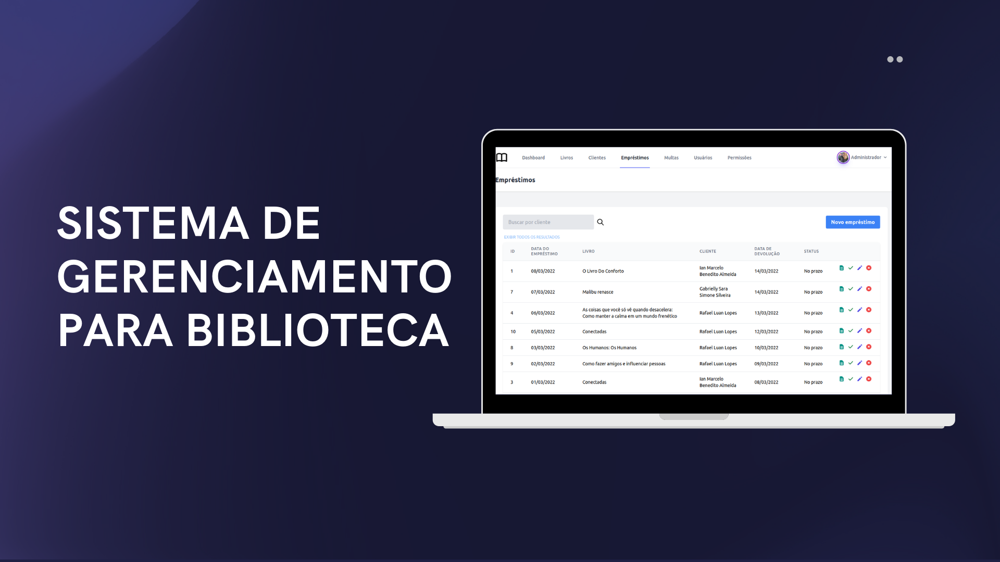
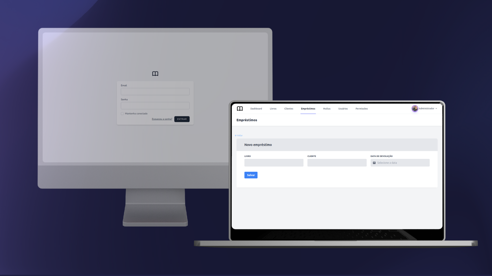

<div 
style="display: flex; 
flex-direction: row;
gap: 10px">


</div>

<br>
<div align="center" style="display: flex; flex-direction: row">
   
    
    
</div>
<br>

<h1> Sistema de gerenciamento para biblioteca 📚</h1>
<b> Índice </b>
<div>
<ul>
<li><a href="#-sobre-o-projeto">Sobre o projeto</a></li>
<li><a href="#-funcionalidades">Funcionalidades</a></li>
<li><a href="#-features">Features</a></li>
<li><a href="#-tecnologias">Tecnologias</a></li>
<li><a href="#-como-executar-a-aplicação">Como executar a aplicação</a></li>
<li><a href="#-como-contribuir">Como contribuir</a></li>
<li><a href="#-autor">Autor</a></li>
<li><a href="#-licença">Licença</a></li>
</ul>
<div>
<div>
<h2>📄 Sobre o projeto</h2>
<b>Status: Em construção 🚧 </b><br><br>
<p> A aplicação desenvolvida consiste em um sistema de gerenciamento para bibliotecas, possibilitando o usuário realizar as principais atividades necessárias em uma biblioteca, como cadastrar livros e clientes e realizar os empréstimos.</p>
</div>
<div>
<h2>🔧 Funcionalidades</h2>
<ul>
<b>Usuários</b>
<li>Cadastrar usuário</li>
<li>Visualizar usuários</li>
<li>Editar usuários
<li> Remover usuários</li>
<li>Gerenciar permissões dos usuários</li>
</ul>
<ul>
<b>Clientes</b>
<li>Cadastrar clientes</li>
<li>Visualizar clientes</li>
<li>Editar clientes
<li> Remover clientes</li>
</ul>
<ul>
<b>Livros</b>
<li>Cadastrar livros</li>
<li>Visualizar livros</li>
<li>Editar livros
<li> Remover livros</li>
</ul>
<ul>
<b>Empréstimos</b>
<li>Realizar empréstimo de livros para os clientes, respeitando as condições para empréstimo</li>
<li>Listar os empréstimos, pesquisando pelo nome do cliente</li>
<li>Editar um empréstimo, antes da devolução</li>
<li>Renovar empréstimos</li>
<li>Excluir empréstimo, antes da devolução</li>
<li>Dar baixa nos livros devolvidos</li>
<li>Calcular multas caso um livro não seja devolvido no prazo</li>
<li>Quitar as dívidas do cliente com a biblioteca</li>
</ul><br>
</div>
<div>
<h2>🔨 Features</h2>
<ul>
<li>Melhorar o dashboard do sistema</li>
<li>Melhorar a interface do sistema</li>
<li>Melhorar pop-up de confirmação ao excluir</li>
<li>Colocar modo dark na aplicação</li>
<li>Permitir a ordenação das colunas na tabela</li>
<li>Envio de e-mail ao realizar o empréstimo e realizar a sua devolução</li>
<li>Permitir adicionar fotos dos livros e dos clientes</li>
<li>Exibir fotos dos livros, clientes e usuários na tabela</li>
<li>Permitir pagamento parcial da multa</li>
<li>Validar os campos quando for editar informações</li>
<li>Exibir nome dos livros e dos clientes no select de empréstimos, ao invés do ID.</li>
<li>Utilizar o formato de data 'DD/MM/YYYY' no dayPicker.</li>
<li>Calcular automaticamente a data de devolução do livro</li>
<li>Criar uma área ou modal específico para renovação do livro</li>
</ul>
<br>
</div>
<div>
<h2>🧑‍💻 Tecnologias</h2>
<a href="https://www.php.net/manual/en/">

</a>
<a href="https://laravel.com/docs/8.x">

</a>
<a href="https://tailwindcss.com/docs/installation">

</a>
<a href="https://dev.mysql.com/doc/">

</a>
<br></br>
</div>
<div>
<h2>🚀 Como executar a aplicação</h2>
<b>Pré-requisitos</b>
<p>Antes de começar, você deve ter instalado em sua máquina, as seguintes ferramentas: <a href="https://git-scm.com/">Git</a>, <a href="https://www.php.net/downloads.php">PHP</a> (de preferência a versão 7.4), <a href="https://getcomposer.org/download/">Composer</a>, <a href="https://www.mysql.com/downloads/">MySQL</a> e também um editor, para trabalhar com o código, como o <a href="https://code.visualstudio.com/">VSCode</a>.
<br><br>
<b>Download do projeto</b>
<br>
1. Clone este repositório executando: <br>
<i>git clone https://github.com/andersondev96/library-project</i>
<br>
2. Acesse a pasta <i>/library-project</i>.
<br>
3.Abra o VSCode, rodando: <i>code .</i><br>
4. Instale as dependências do projeto, com o comando: <i>composer install</i><br><br>
<b>Configuração do banco de dados</b><br>
1. No arquivo <i>.env</i>, configure as credenciais do banco de dados, utilize o <i>.env.example</i>, caso seja necessário.

```
DB_CONNECTION=mysql
DB_HOST=127.0.0.1
DB_PORT=3306
DB_DATABASE=library
DB_USERNAME=<username>
DB_PASSWORD=<password>
```
2. Agora você deve rodar este <a href="script.sql">script mysql</a>, par o seu banco de dados aparecer, povoado.
3. Após rodar o script, execute a aplicação com o comando **php artisan serve**.
4. Rode a aplicação na porta **http://localhost:8000**.

<br>
<h2>🤝 Como contribuir</h2>
<ol>
    <li>Faça um fork do repositório.</li>
    <li>Crie uma nova branch com as suas alterações: <code>git checkout -b my-feature</code>.</li>
    <li>Salve as suas alterações e crie uma mensagem de commit, dizendo o que você fez: <code>git commit -m "feature: My new feature"</code>.</li>
    <li>Envie as suas alterações:<code>git push origin my-feature</code>.</li>
</ol>
<br>
<h2>👥 Autor</h2>
<a href="https://www.linkedin.com/in/anderson-fernandes96/">
    <div style="display: flex; flex-direction: column; align-items: center; gap: 10px">
    
    <strong>Anderson Fernandes Ferreira</strong>
    </div><br>
    <div style="display:flex; flex-direction:row;gap:8px;">
        <a href="https://instagram.com/anderson_ff13" target="_blank"></a>
  <a href = "mailto:andersonfferreira96@gmail.com.br"></a>
  <a href="https://twitter.com/anderson_4nd" target="_blank"></a> 
    <a href="https://www.linkedin.com/in/anderson-fernandes96/" target="_blank"></a> 
    </div>

</a>
<br>
<h2>📝 Licença</h2>
    <p>Este projeto está sobre a licença <a href="LICENSE">MIT</a>.

Feito com 💚 por Anderson Fernandes 👋 
<a href="https://www.linkedin.com/in/anderson-fernandes96/">Entre em contato!</a>
<br>
<h2>Versões do README</h2>
🇧🇷 Português | 🇺🇸 English


